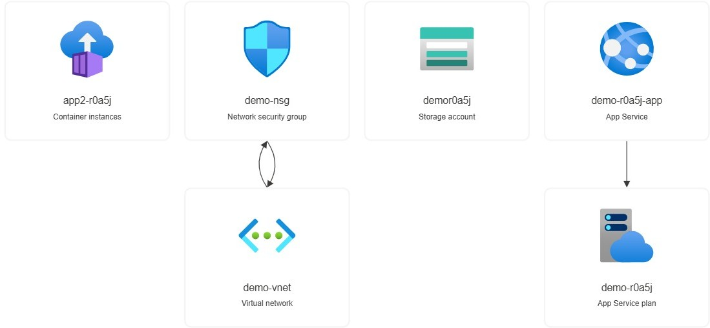

# NeuranX Assignment - Azure

## 📌 Overview
This project provisions a small Azure infrastructure stack using Terraform, focusing on clean, reusable Infrastructure as Code (IaC).

---

## 📖 Table of Contents
* [📋 Prerequisites](#-prerequisites)
* [🛠️ Resources Created](#%EF%B8%8F-resources-created)
* [🚀 Additional Compute: Azure App Service](#-additional-compute-azure-app-service)
* [🌐 Access](#-access)
* [💻 How to Run](#-how-to-run)
* [💾 Remote State](#-remote-state)
* [📐 Design Notes](#-design-notes)
* [🔄 CI/CD Pipeline](#-cicd-pipeline)
* [⚠️ Challenges Faced & Solutions](#%EF%B8%8F-challenges-faced--solutions)
* [⚙️ Setup Guides](#%EF%B8%8F-setup-guides)
* [🤖 AI Usage Declaration](#-ai-usage-declaration)
* [🔗 References](#-references)

---

## 📋 Prerequisites

Please ensure the following tooling, versions, and cloud access requirements are satisfied prior to initialization.

### Tooling Requirements

| Tool | Minimum Version | Purpose |
| :--- | :--- | :--- |
| **Terraform CLI** | `v1.5.0` | Infrastructure deployment & state management |
| **Azure CLI** | `v2.50.0` | Local account authentication & credential provisioning |
| **Git** | `v2.30.0` | Version control & remote repository management |

### Cloud & Platform Access

| Platform | Requirement | Purpose |
| :--- | :--- | :--- |
| **Azure Subscription** | Active status | Hosting target resources |
| **Azure IAM Role** | `Contributor` or `Owner` | Provisioning permissions inside subscription bounds |
| **GitHub Account** | Repository Admin | Configuring pipeline secrets & running CI/CD |

---

## 🛠️ Resources Created
* **Resource Group**
* **Storage Account + Container**
* **Virtual Network + Subnet**
* **Network Security Group (NSG)**
* **Azure Container Instances (ACI)**
* **Azure App Service**



---

## 🚀 Additional Compute: Azure App Service
An Azure Linux Web App is deployed using a basic App Service Plan.

* **Engine:** Runs an NGINX container.
* **Security:** Public HTTPS endpoint.
* **Operations:** Managed PaaS (no infrastructure maintenance).

### Why App Service?
* Simpler than managing containers directly.
* Built-in scaling options.
* Production-friendly platform.

---

## 🌐 Access
After deployment, you can access your resources via the following endpoints:

* **Azure App Service URL:** `https://<your-app-service-name>.azurewebsites.net`
* **Azure Container Instance (ACI) FQDN:** `http://<your-aci-dns-label>.<region>.azurecontainer.io`

---

## 💻 How to Run

### 1. Authenticate
```bash
az login
```

### 2. Initialize
```bash
terraform init
```

### 3. Validate
```bash
terraform validate
```

### 4. Plan
```bash
terraform plan -var-file="terraform.tfvars"
```

### 5. Apply
```bash
terraform apply -var-file="terraform.tfvars"
```

---

## 💾 Remote State
The infrastructure utilizes an Azure Storage backend configured in the `backend.tf` file:

* **Storage Account:** Stores the state file securely.
* **Blob Container:** Holds the `.tfstate` file path.
* **State Locking:** Enabled via Azure Blob storage leases to prevent concurrent execution conflicts.

---

## 📐 Design Notes

### Decisions
* **ACI over VM:** Chosen for lightweight, fast provisioning.
* **NSG Rules:** Minimal footprint (only HTTP/HTTPS allowed via least privilege).
* **Random DNS Suffix:** Implemented to avoid naming collisions across global Azure regions.
* **Parameterized Config:** Variables used globally to promote module reuse.

### Trade-offs
* No auto-scaling configured for the container instances.
* Public endpoints are used instead of securing resources inside a private subnet.
* Minimal logging and monitoring tools are implemented.

---

## 🔄 CI/CD Pipeline
The deployment relies on GitHub Actions pipelines split into distinct stages:

### Stage 1: Lint & Validate (`validate_and_lint`)
* Runs `terraform fmt` to check style.
* Runs `terraform validate` to check syntax.

### Stage 2: Plan & Apply (`deploy`)
* Runs only if Stage 1 finishes successfully (`needs: validate_and_lint`).
* Executes `terraform plan` and generates structural execution receipts.

---

## ⚠️ Challenges Faced & Solutions

### 1. Global Resource Naming Conflicts
* **Challenge:** Azure Storage Accounts and App Services require globally unique DNS names. Initial resource creation attempts failed because common naming variations were already taken by other users globally.
* **Solution:** Integrated the Terraform `random_string` resource to dynamically generate a 6-character unique suffix, appending it to resource names during evaluation.

### 2. Concurrent State Modification Risks
* **Challenge:** Working with local `.tfstate` files risked state corruption if multiple developers or sequential CI/CD pipeline triggers executed simultaneously.
* **Solution:** Migrated infrastructure state from local files to an Azure Storage Account backend, utilizing automatic Blob storage leases to enforce strict distributed state locking.

### 3. GitHub Actions Pipeline Authentication
* **Challenge:** Securely passing deployment permissions to the GitHub Actions worker without hardcoding vulnerable IAM keys or interactive passwords.
* **Solution:** Generated a dedicated, scoped Azure Service Principal via the Azure CLI and safely embedded its JSON payloads into GitHub encrypted repository secrets as `AZURE_CREDENTIALS`.

---

## ⚙️ Setup Guides

### 1. Generate Azure Credentials
Create an Azure Service Principal with **Contributor** access to authenticate the GitHub pipeline:
```bash
az ad sp create-for-rbac --name "myTerraformSP" --role contributor --scopes /subscriptions/<SUBSCRIPTION_ID> --sdk-auth
```

### 2. Configure GitHub Secrets
Save the JSON output from the command above into your GitHub repository settings under **Settings > Secrets and variables > Actions** using the following key:
* `AZURE_CREDENTIALS`

---

## 🤖 AI Usage Declaration
AI tools (ChatGPT / Copilot) were used for:

* Structuring Terraform best practices.
* Generating initial scaffolding.
* Improving README clarity and readability.

*Note: All code was reviewed, adjusted, and validated manually.*

---

## 🔗 References

* **Terraform Documentation:** [Azure Provider Reference](https://terraform.io)
* **Terraform Backend:** [AzureRM Backend Configuration Guide](https://hashicorp.com)
* **Microsoft Azure Documentation:** [Azure Container Instances (ACI) Overview](https://microsoft.com)
* **Microsoft Azure Documentation:** [Azure App Service Documentation](https://microsoft.com)
* **GitHub Actions Workflow:** [Automating Terraform with GitHub Actions](https://hashicorp.com)
